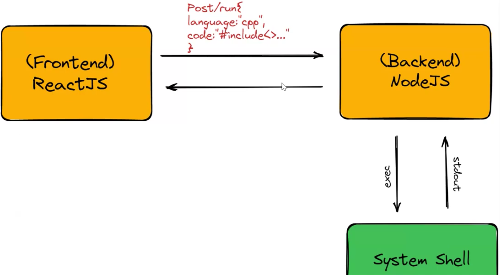

## Online Compiler Build

- a web app that helps to run your logic online.
- easier way to test code.
- debugging errors, saving time, enabling portability and accessibility anywhere.
- Online Judge = Online Compiler + x.
- We need to build an Online Compiler for our application.

# Overview of this our Online Compiler

- Childprocess: a in-built module for node.js
- C++, Python, Java -> major languages
- current dependency -> g++ compiler need to be installed inside our system to run cpp.
- but with docker we can optimise and remove this dependency.
- No system dependancy needed if docker used.
- First no user input compiler.

# Using Child Process to Run System Commands

- What is Child Process:
  - Child processes are instances of the operating system that run concurrently with the parent process.
- Examples of a Running a system command
  - The code `child_process.exec('node -v', (err, stdout, stderr) => console.log(stdout);})` will display the current version of Node.js -> damn
- Benefits of using child_process:

  - This approach allows the devs to execute system commands within their code and simplify the integration of the other system tools.

- Terminal: Child process automates the stuff, with the help of child_process u can access the terminal and run commands
- Child Process basically helps to autmate stuff just like writing command to execute inside code but outside of terminal(CLI) itself.
  

- What do we need to send?
- POST method: language to know what we are trying, and code, based on the language we are going to run the command.

- For an Online Compiler -> POST "/run" -> to run the code
- For an Online Judge -> POST "/run" && POST "/verdict" -> to judge the code

# UUID, FS and Path Modules -> In-built modules of Node.js

- The UUID(Unique Universal Identifier) module is used for generating random unique IDs. This can be done using 100 Lava Lamps and god knows how strong pixel cameras.
- FS File System module is used for working with the file system in Node.js. It can read , write and modify the file data.
- the path modules provides methods for workibg with the file and directory paths. It can join pathsm get the current working directory and resolve relative paths

- These are going to be required by us.
